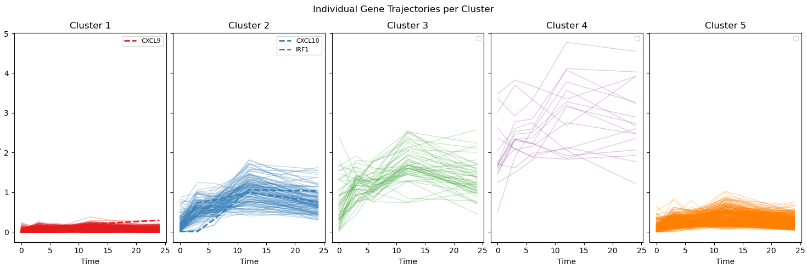
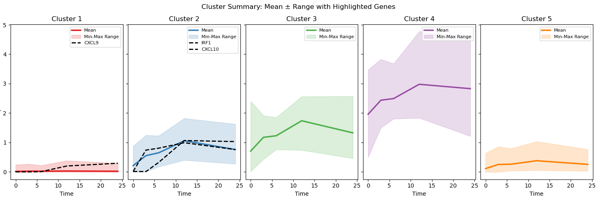

# VRNN_Gene_Clustering for Single-Cell RNA Seq

This repository implements a Variational Recurrent Neural Network (VRNN) to model temporal gene expression dynamics from single-cell RNA-seq data. The learned latent space is used to cluster genes based on their dynamic profiles in response to stimulation (e.g., IFNγ). This enables identification of gene clusters (such as fast vs. slow responders like IRF1 vs. CXCL9/10) and downstream inference of potential cis-regulatory elements (CREs).

## Project Goal
We aim to:

Capture latent dynamics from time-series scRNA-seq data using VRNNs.

Cluster genes based on their latent representations over time.

Identify genes with similar expression dynamics to candidate genes (e.g., IRF1, CXCL9, CXCL10).

Enable follow-up CRE analysis of these gene modules.




## Directory Structure

```
vrnn-clustering/
├── main.py                 # Entry point: trains VRNN, projects latents, clusters genes
├── requirements.txt        # Python dependencies
├── README.md               # You are here
├── outputs/                # Example outputs (plots, cluster CSVs)
└── src/
    ├── models.py           # VRNN model & loss
    ├── train.py            # Training loop
    └── utils.py            # Tensor creation, UMAP, clustering, plot
```

## Installation
```
pip install -r requirements.txt
```

## Input Data Format
Select the 1000 most variable genes from your scRNA-seq data. 
Then, place your scRNA-seq matrix in data/master_sheet.csv.
The expected format:

Rows: cells 

columns: Cell_ID, CellType, Time_numerics, followed by gene expression

By default, the model uses the first 1000 genes after column index 3. You can modify this in main.py.
Make sure to sort the cells by time nuumerics (earliest to latest) as this model assumes cells are ordered by time. 

## Core Modules
``` 
main.py
```
- Orchestrates the pipeline.
- Loads data, trains the model, extracts latent features, performs clustering, and generates visualizations.

```
models.py
```
Implement the VRNN architecture:
- GRU-based recurrence.
- Gaussian prior/posterior for latent z.
- Reconstruction and KL loss terms.

```
train.py
```
- Manages training and validation loops.
- Handles batching, optimization, logging of loss curves.
- Model checkpoints can be added here if needed.

```
utils.py
```
include methods that: 
- create VRNN Cluster
- plot the umap model based on latent clusters post-training
- plot gene dynamics (default: gene_per_cluster = 10) to ensure appropriate clusters are formed
- save each cluster to .csv format
- plot selected genes based on gene names
  
## License
This project is licensed under the MIT License – see the [LICENSE](LICENSE) file for details.


